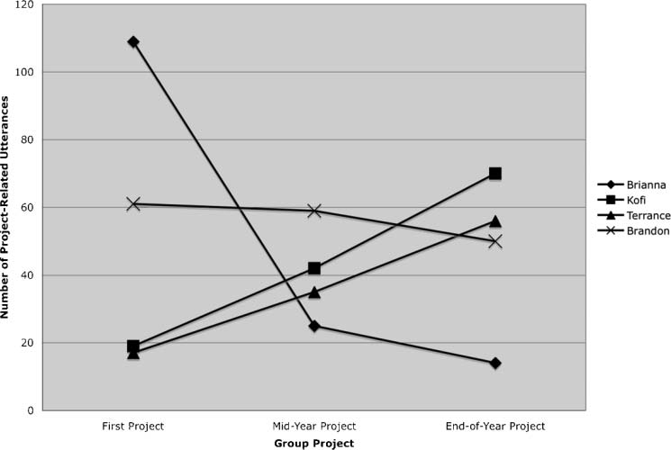
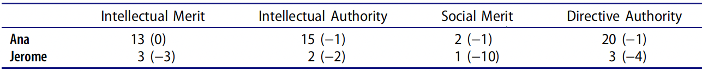
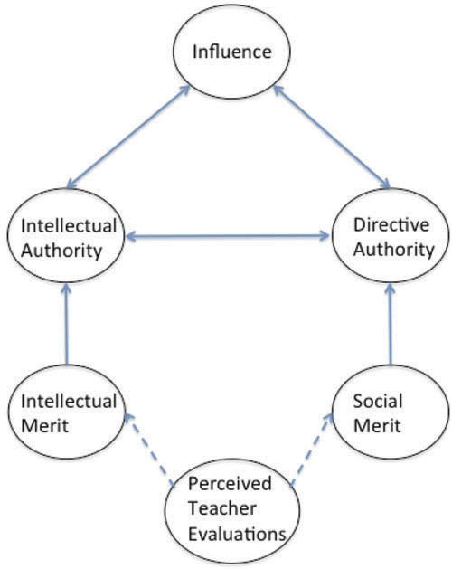

```{r setup, include = FALSE}
# R options
options(
  htmltools.dir.version = FALSE,
  tibble.width = 65,
  width = 65
  )

# figure height, width, dpi
knitr::opts_chunk$set(fig.width = 8, 
                      fig.asp = 0.618,
                      out.width = "60%",
                      fig.align = "center",
                      dpi = 300)

# fontawesome
htmltools::tagList(rmarkdown::html_dependency_font_awesome())

# magick
dev.off <- function(){
  invisible(grDevices::dev.off())
}

# xaringanExtra
library(xaringanExtra)
xaringanExtra::use_panelset()

library(emo)
```

class: middle, inverse

```{r set-theme, include = FALSE}
library(xaringanthemer)
style_duo_accent(
  primary_color      = "#b76352", # mango
  secondary_color    = "#34605f", # bayberry
  header_font_google = google_font("Raleway"),
  text_font_google   = google_font("Raleway", "300", "300i"),
  code_font_google   = google_font("Source Code Pro"),
  header_color = "#793540", #rhubarb
  white_color = "#F5F5F5", # lightest color
  black_color = "#36454F", # darkest color
  text_font_size = "30px", 
  link_color = "#a17b76" #pink
)
```

## .larger[.grey[.hand[Welcome!]]]

.center[
.large[
.honey[
Link for slides & resources: 
]

🔗 [https://bit.ly/student-authority](https://bit.ly/student-authority)
]]

---

class: center, middle

.larger[Land Acknowledgement]

.bayberry[Cal Poly sits on the land of the yak titʸu titʸu yak tiłhini,
Northern Chumash tribe. We acknowledge, respect, and thank the yak titʸu titʸu
yak tiłhini on whose **stolen land** we are guests. 

Indigenous people are not relics of the past. We who work and live here must
bear witness to the ongoing effects of colonization.

<!-- Land acknowledgements do not exist in a past tense, or historical context:  -->
<!-- colonialism is a current ongoing process, and we need to build our mindfulness -->
<!-- of our present participation. -->
]

---

class: center, middle, inverse 

.huge[.hand[My Background]]

---

class: middle

<center>
.larger[.rhubarb[Overview]]
</center>

.large[
1. A conversation about group work  

2. Findings from research on group work from Mathematics Education  

3. Discussion of how students and educators can attend to issues of power in the
classroom
]
---

class: center, middle, inverse

.larger[.mango[Let's start with a conversation...]]

--

.large[What successes have you experienced with group work?]

.large[What issues have you experienced with group work?]

---

class: middle

.larger[.bayberry[What do I mean by student "authority"?]]

--

.pull-left[
*Intellectual Authority* 

- Ideas are evaluated as high quality
- Gains and maintains conversational floor without interruption
- Are spatially attended to
]

--

.pull-right[
*Directive Authority*

- Ability to issue directives to peers
- Authority to manage group dynamics
]

---

class: center, middle

.larger[Why is student authority important?]

--

Learning in classrooms goes beyond understanding new concepts. 

--

Students also learn who they are and what they can and cannot do. 

<!-- Students’ identities are “dynamically negotiated,” representing a synthesis of -->
<!-- who they are and who they have learned to be through interactions with others.  -->

--

These identities / beliefs largely determine what students' participation in the
classroom looks like. 

---

class: center, middle, inverse

.huge[.hand[.honey[Classroom Discourse]]]

---

class: middle

<center>
.larger[.dark-blue[Terri & Bonnie]]  
</br>
.large[(Bishop, 2012)]
</center>

--

.pull-left[
 Terri enacted the identity of the mathematical expert.

- Speaking with authority 
- Taking a position of superiority
<!-- Requesting information from Bonnie -->
- Controlling the group's activity and the uptake of ideas
<!-- Of 15 instances, 13 Terri controlled  -->
- Inserting Bonnie to save face
<!-- Telling her to raise her hand when they weren't done -->
]

--

.pull-right[
Bonnie enacted the identity of mathematically helpless. 

- Requesting information
<!-- Twice as often as Terri -->
- Rarely asked questions or initiated solutions
- Positions herself as "dumb"
]

---

class: middle

<center>
.large[***Meta-level intentions are likely to reside in the mechanisms of
interaction rather than in their explicit contents.*** (Sfard, 2001)]
</center>

--

.pull-left[
.large[.gray[Bonnie]]
- 80% of Bonnie's discursive moves were to provide information to Terri  

- 1 in 8 of her responses would be corrected, rejected, reprimanded, or doubted
]

--

.pull-right[
.large[.gray[Terri]]

- Primary initiator & talks twice as much 

- Determines who gets the floor by responding to herself & selectively
responding to Bonnie
]

---

class: middle

<center>
.larger[.bayberry[Brianna & Kofi]]
</br>
.large[(Langer-Osuna, 2011)]
</center>
--

.pull-left[
- Took initial lead in group  

- Positioned by teacher as example of good leadership  

- Midway through project group members positioned her as bossy
]

--

.pull-right[
- Initially uninvolved in group  

- Positioned by boys as smart  

- Was given intellectual and directive authority by the boys
]

---

class: middle, center

<center>
.large[***Boys don't listen to girls. It's not just in the classroom, it's
outside, too.*** (Brianna)]
</center>

--

```{r, echo = FALSE, out.height = "60%"}

```

---

class: middle

<center>
.larger[.gray[Anna & Jerome]]
</br>
.large[(Langer-Osuna, 2016)]
</center>

--



---

class: center

.pull-left[
.larger[**The role of the teacher**]

- Anna was positioned as behaving like a "good student" twice and off-task once

- Jerome was positioned as off-task 10 times and on-task once
]

```{r, echo = FALSE, out.height = "20%", out.width = "40%", fig.align = 'right'}

```

---

class: middle

<center>
.larger[.rhubarb[Uma & Sean]]  
</br>
.large[(Theobold & Williams, 2022)]
</center>

--

.pull-left[
- Solely responsible for establishing and maintaining a collaborative
environment  

- Never used closed language

- At the expense of having her mathematical thinking positioned as significant 
]

--

.pull-right[
- Shared his thinking in 86% of interactions

- Had his ideas positioned by Uma as significant in 60% of interactions

- Used closed language in 72% of interactions
]

---

class: middle

<center>
.large[***Such constant negations of mathematical thinking and work could be
considered a type of microaggression.*** (Gholson & Martin, 2019)]
</center>

--

- Not every microinvalidation experienced by as student rises to the form of 
oppression

- For some groups and in many contexts, the structures that shape a discipline 
in the classroom can create feelings of oppression.

---

class: center, middle, inverse

.huge[.hand[.honey[What can we do?]]]

---

class: middle

<center>
.larger[Tools for Building More Equitable Groups]
</center>

--

- Establishing classroom norms 

--

- Structured participation -- Group roles

--

- Multifaceted tasks -- Require multiple competencies

--

- Recognizing ***your*** interactions with students

---

class: center, middle, inverse

.larger[.mango[Let's end with a conversation...]]

--

.large[What successes have had when structuring equitable group collaborations?]
